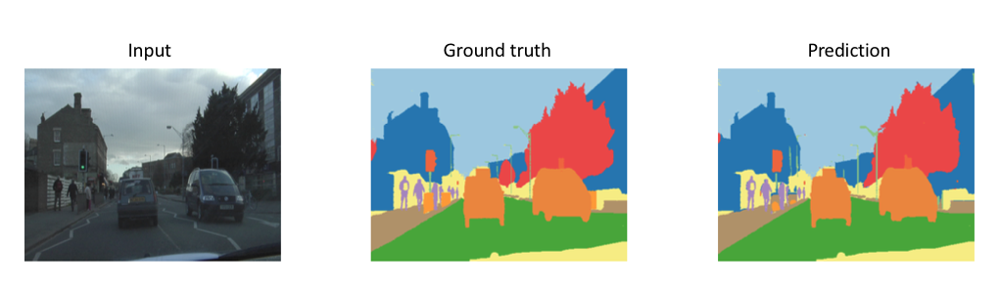
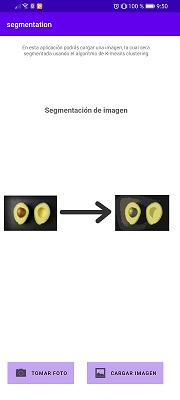
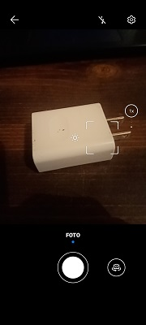
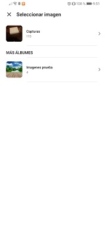
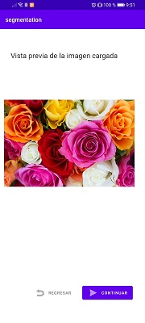
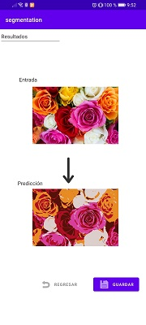

# Image-Segmentation-UPV  

## Introduction  
Image segmentation is an important step in image processing and seems to be everywhere, as there are now many devices that integrate this type of image clustering using an algorithm called k-means, for example, autonomous vehicles need sensory input devices such as cameras, radar and lasers to allow the car to perceive the world around it such as roads, traffic lights, cars, pedestrians to create a digital map. Therefore, we may need to use segmentation to separate objects and analyze each object individually (i.e. image classification) to verify which objects they are. Similarly, in medicine, image processing is also applied for early identification of cancer cells with image classification algorithms using clustering.  
  
The goal of segmenting an image is to change the representation of an image into something more meaningful and easier to analyze. To do this, we must take into account that it is not a good idea to process a complete image, since many parts of an image may not contain useful information. Therefore, by segmenting the image, we can use only the important segments for processing.  
  
## Problem
  
The problem to be solved is to develop a mobile application that allows the end user to take a picture with his device, this picture will be processed by means of the K-Means clustering algorithm and then the segmented image will be returned, offering also the possibility to store it in the device. 
When the image is processed, the result looks like the following figure.  
  

  

  
The purpose of this is to offer a fast and portable solution for image segmentation.
An image is basically a set of given pixels. In image segmentation, pixels that have similar attributes are grouped together. Image segmentation creates a pixel mask for the objects in an image that gives us a more complete and granular understanding of the object.  

## Example  
  
When running the application it shows us information about its purpose, in the central part we can see an example of an image processed in the application, as well as two buttons that allow us to load the image to be processed, either by means of the device's camera or selecting it by means of the image selector, for example: 

  

  
As we can see in the description of these buttons, one of them allows you to take a picture using the device's camera (figure on the left), while the other one allows you to upload an image from the gallery (figure on the right).  
  
| Take a picture | Upload image |
| :---: | :---: |
|  |  |
  
## Preview
  
Once the image has been loaded, a preview of the image is displayed, offering the possibility to return to the previous screen to load another image, or to continue with the currently loaded image.  

  
  
  
Finally, we have the result view, the purpose of this view (figure below) is to show the user the image segmentation process; showing the image loaded by the user and the segmented image by implementing the KMeans algorithm.
In addition, it has the possibility to store the segmented image in the device storage so that it can be used in other domains.  

  
  
